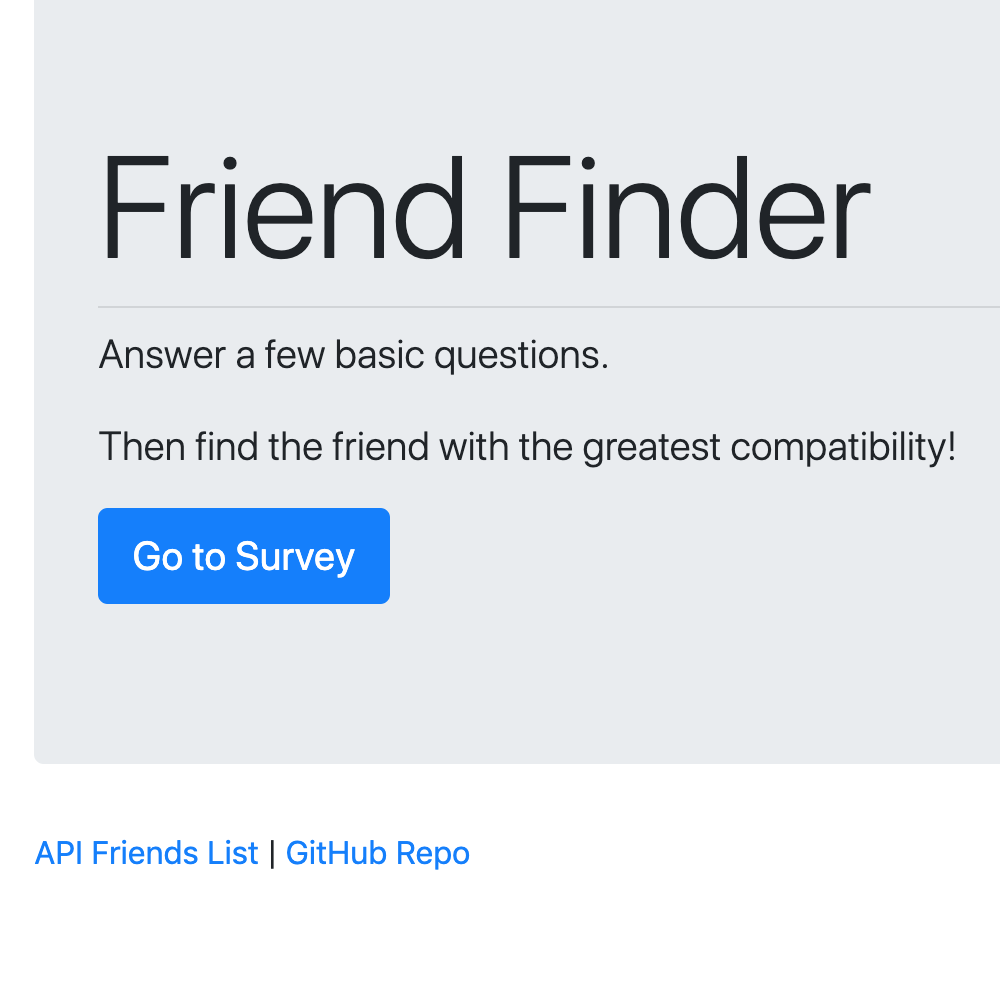

# Friend Finder - Node and Express Servers

### Overview

In this activity, I will build a compatibility-based "FriendFinder" application -- basically a dating app. This full-stack site will take in results from your users' surveys, then compare their answers with those from other users. The app will then display the name and picture of the user with the best overall match.

I will use Express to handle routing. I will deploy the app to Heroku so other users can fill it out.

### App Design Notes

1. The survey should have 10 questions. Each answer should be on a scale of 1 to 5 based on how much the user agrees or disagrees with a question.

2. Determine the user's most compatible friend.

3. Once the app has found the current user's most compatible friend, display the result as a modal pop-up.
   * The modal should display both the name and picture of the closest match.

## Technologies Used:

* Javascript

* Node.js

* Express

## Friend Finder Links:

[FriendFinder](https://friend-finder-sickels.herokuapp.com/)

